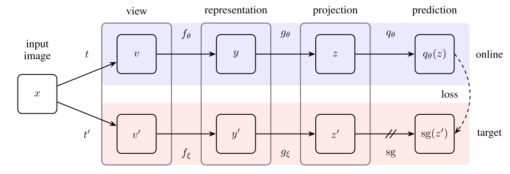

# PyTorch-BYOL
PyTorch implementation of [Bootstrap Your Own Latent: A New Approach to Self-Supervised Learning](https://arxiv.org/abs/2006.07733).



## Installation

Clone the repository and run
```
$ conda env create --name byol --file env.yml
$ conda activate byol
$ python run.py
```

## Config

Before running PyTorch BYOL, make sure you choose the correct running configurations on the config.yaml file.

```
network:
  name: resnet18 # base encoder. choose one of resnet18 or resnet50
   
  # configurations for the projection and prediction heads
  projection_head: 
    mlp_hidden_size: 512 # Original implementation uses 4096
    projection_size: 128 # Original implementation uses 256

data_transforms:
  s: 1
  input_shape: (96,96,3)

trainer:
  batch_size: 64 # Original implementation uses 4096
  m: 0.996 # momentum update
  checkpoint_interval: 5000
  max_epochs: 40 # Original implementation uses 1000
  num_workers: 4 # number of worker for the data loader

optimizer:
  params:
    lr: 0.03
    momentum: 0.9
    weight_decay: 0.0004
```

## Feature Evaluation

We measure the quality of the learned representations by linear separability.

During training, BYOL learns features using the STL10 ```train+unsupervised``` set and evaluates in the held-out ```test``` set.

|       Linear Classifier      | Feature  Extractor | Architecture | Feature dim | Projection Head  dim | Epochs | Batch  Size | STL10 Top 1 |
|:----------------------------:|:------------------:|:------------:|:-----------:|:--------------------:|:------:|:-----------:|:-----------:|
|      Logistic Regression     |    PCA Features    |       -      |     256     |           -          |    -   |             |    36.0%    |
|              KNN             |    PCA Features    |       -      |     256     |           -          |    -   |             |    31.8%    |
| Logistic Regression  (LBFGS) |     BYOL (SGD)     |   ResNet-18  |     512     |          128         |   40   | 64          |    70.1%    |

